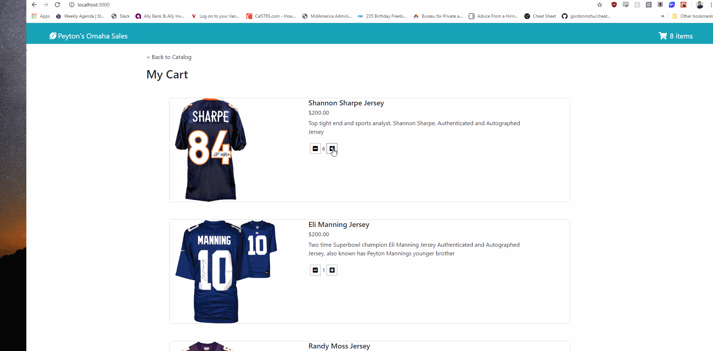

# Peyton's Omaha Sales

> - Maintained by: `James Dinh - jdinh8124`

## Live
[Link To Live Site](https://peytons-omaha-sales.jamestdinh.com/)

## Summary
A full stack Node.js and React shopping cart app that stores data in PostgreSQL.

## Languages Used
- React
- JavaScript
- NodeJS
- PostgreSQL
- HTML5
- CSS3

## Features
- Users can see a list of autographed jerseys listed for sale
- Users can click on jerseys to get a closer view of the item
- Users can add items to their cart
- Users can delete items from their cart
- Users can add multiple quanitities of items from cart
- Users can checkout their purchase through a validated form which stores critical information on a database


## Planned Additions
- Users can view current deals with a React carousel
- Users can view more jerseys for sale


## Takeaways
- The power of react and react props in making site building more efficent
- The power of reusuable elements in creating a site
- How React helps make an efficent UX/UI design
- The power of bootstrap when combined with a framework such as React

## Getting Started
1. Clone this repository from your github to your local computer
```

git clone https://github.com/jdinh8124/Peytons-Omaha-Sales 

```
2. Go into this repositorys directory using a terminal
```
cd peytons-omaha-sales

```
3. Run "npm install"
``` 

npm install

```
4. Run npm dev
``` 

npm run dev

```
5. Open your browser to localhost:3000
```  

https://localhost:3000 

```
6. Enjoy and make sure this is just an example site! No sales can be made!

## Live Demo

